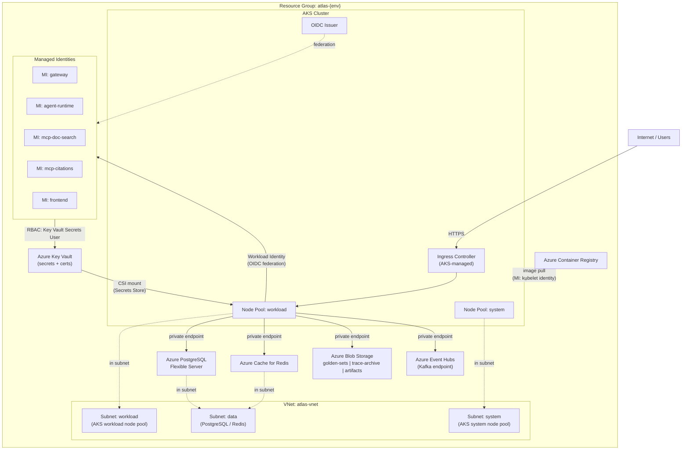

# Azure Resource Topology

Atlas Azure infrastructure — resource groups, networking, compute, data, and identity layers, and how pods reach external services.

```mermaid
flowchart TD
    subgraph RG["Resource Group: atlas-{env}"]
        subgraph VNET["VNet: atlas-vnet"]
            SN_SYS["Subnet: system\n(AKS system node pool)"]
            SN_WORK["Subnet: workload\n(AKS workload node pool)"]
            SN_DATA["Subnet: data\n(PostgreSQL / Redis)"]
        end

        subgraph AKS["AKS Cluster"]
            NP_SYS["Node Pool: system"]
            NP_WORK["Node Pool: workload"]
            OIDC["OIDC Issuer"]
            INGRESS["Ingress Controller\n(AKS-managed)"]
        end

        subgraph IDENTITY["Managed Identities"]
            MI_GW["MI: gateway"]
            MI_AGENT["MI: agent-runtime"]
            MI_MCP_DOC["MI: mcp-doc-search"]
            MI_MCP_CIT["MI: mcp-citations"]
            MI_FE["MI: frontend"]
        end

        KV["Azure Key Vault\n(secrets + certs)"]
        PG["Azure PostgreSQL\nFlexible Server"]
        REDIS["Azure Cache for Redis"]
        BLOB["Azure Blob Storage\ngolden-sets | trace-archive | artifacts"]
        ACR["Azure Container Registry"]
        EH["Azure Event Hubs\n(Kafka endpoint)"]
    end

    INTERNET["Internet / Users"] -->|HTTPS| INGRESS
    INGRESS --> NP_WORK

    NP_SYS -.->|"in subnet"| SN_SYS
    NP_WORK -.->|"in subnet"| SN_WORK

    NP_WORK -->|"Workload Identity\n(OIDC federation)"| IDENTITY
    IDENTITY -->|"RBAC: Key Vault Secrets User"| KV
    KV -->|"CSI mount\n(Secrets Store)"| NP_WORK

    NP_WORK -->|"private endpoint"| PG
    NP_WORK -->|"private endpoint"| REDIS
    NP_WORK -->|"private endpoint"| BLOB
    NP_WORK -->|"private endpoint"| EH

    PG -.->|"in subnet"| SN_DATA
    REDIS -.->|"in subnet"| SN_DATA

    ACR -->|"image pull\n(MI: kubelet identity)"| AKS

    OIDC -.->|"federation"| IDENTITY
```
