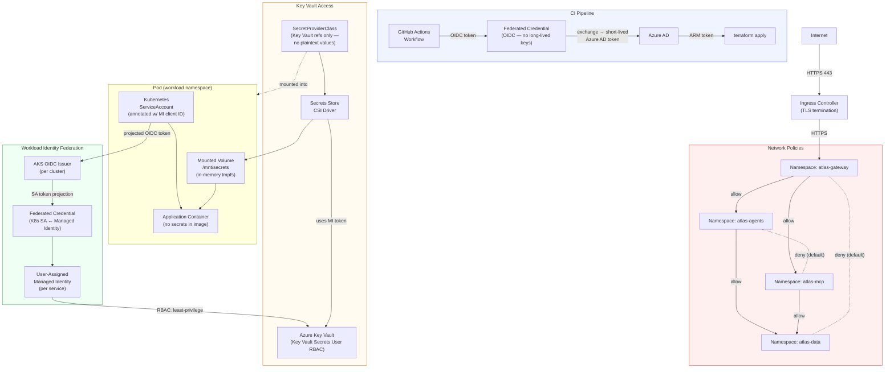

# Identity, Secrets & Network Security Model

How Atlas enforces zero-secrets-in-code (NFR2): Workload Identity federation, Key Vault CSI mounts, namespace network policies, and OIDC-based CI authentication.

