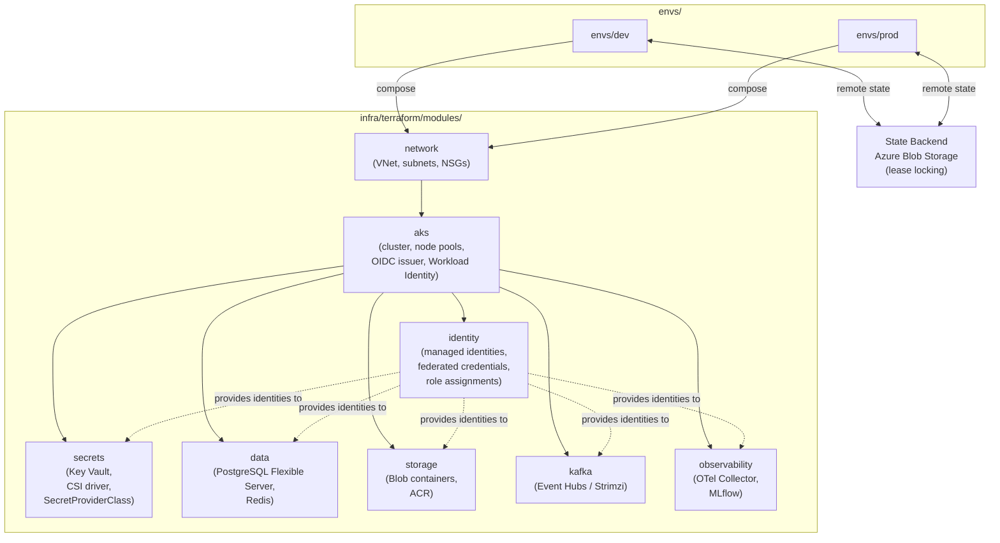

# Terraform Module Dependency Graph

Module composition and dependency order for `atlas-infra`. Environments (`envs/dev`, `envs/prod`) instantiate all modules; state is stored in Azure Blob Storage.

